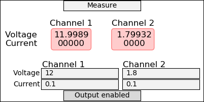

# Keithley 2220-30-1 DC Power Supply Control

## *CUSTOMIZED

> Added configuration of virtual environment

> Added installation of GUI program with desktop file (using Icon from [flaticon](https://www.flaticon.com/))

## Description

Script for controlling a Keithley 2220-30-1 DC power supply via SCPI commands sent via USB:

KeithleyControl.py is a command line script for setting the voltage and current, checking the status of the device, and monitoring the output values.

KeithleyGUI.py is a GUI based on matplotlib which allows the user to change the voltage and current.

Information on the SCPI interface for the Keithley 2200 series devices can be found in [this document](https://www.tek.com/dc-power-supply/series-2220-2230-2231-multiple-output-manual-0)

## Requirements

Install the python-usbtmc package:

    pip install python-usbtmc

You will likely need to edit **/etc/udev/rules.d/99-garmin.rules** as root, adding this line:

    SUBSYSTEM=="usb", ATTR{idVendor}=="VVVV", ATTR{idProduct}=="PPPP", MODE="666"

where *VVVV* and *PPPP* are the vendor and product id, and can be found by running

    lsusb

which yeilds this output:

      Bus 001 Device 067: ID VVVV:PPPP Keithley Instruments

Once the file has been edited, restart udev with:

    sudo udevadm trigger

## Usage

### KeithleyControl.py

    usage: KeithleyControl.py [-h] [-v1 VOLTAGE1] [-v2 VOLTAGE2] [-c1 CURRENT1]
                          [-c2 CURRENT2] [-s] [-o {off,on,keep}] [-f MACRO]
                          [-l LINE] [-u VENDOR_ID PRODUCT_ID] [-m FILE]

    Program a Keithley 2220-30-1 DC power supply

    optional arguments:
      -h, --help            show this help message and exit
      -v1 VOLTAGE1, --voltage1 VOLTAGE1
                            Voltage setting for channel 1 in volts
      -v2 VOLTAGE2, --voltage2 VOLTAGE2
                            Voltage setting for channel 2 in volts
      -c1 CURRENT1, --current1 CURRENT1
                            Current setting for channel 1 in mA
      -c2 CURRENT2, --current2 CURRENT2
                            Current setting for channel 2 in mA
      -s, --status          Display voltage and current settings
      -o {off,on,keep}, --output {off,on,keep}
                            Enable/disable output
      -f MACRO, --macro MACRO
                            A SCPI macro file
      -l LINE, --line LINE  A single command to send to the device
      -u VENDOR_ID PRODUCT_ID, --usb VENDOR_ID PRODUCT_ID
                            USB vendor and product IDs
      -m FILE, --monitor FILE
                            Measure voltage, current, and power on all channels at
                            1Hz, writing to FILE

### KeithleyGUI.py

Clicking the "Measure" Button will refresh the measured voltage and current displayed in the red boxes.

Typing a number into the "Voltage" or "Current" field in the lower half of the window will change the setting on the appropriate channel.

Clicking the "Output enabled / Output disabled" button at the bottom will toggle the output of the device.
